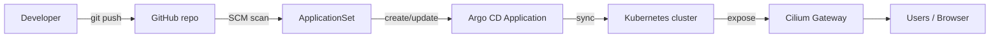

# platform-bootstrap

Bootstrap repo for the Hellnetsh Argo CD IDP.

## Goal
Single source of truth for Argo CD bootstrapping.

This repo defines:
- who Argo CD can read
- what repos are allowed
- how apps are discovered
- where apps are deployed

## Map
```text
GitHub org: hellnetsh
  ├─ platform-bootstrap
  │   ├─ AppProject: hellnetsh
  │   └─ ApplicationSet: hellnetsh-apps
  │
  ├─ argocd-demo
  ├─ whoami-demo
  └─ echo-demo

Argo CD
  ├─ reads GitHub via repo-creds PAT
  ├─ scans repos in org hellnetsh
  ├─ matches repos with k8s/kustomization.yaml
  └─ creates one Application per repo

Cluster
  ├─ namespace per app
  ├─ Deployment / Service / HTTPRoute
  └─ synced automatically by Argo CD
```

## Diagram


## Flow
```text
git push
  → GitHub repo updated
  → ApplicationSet scans org hellnetsh
  → matching repo found
  → Argo CD creates/updates Application
  → Argo CD syncs manifests into the cluster
```

## Current rules
- repo must live in org `hellnetsh`
- repo must expose `k8s/kustomization.yaml`
- app is created with the repo name
- namespace defaults to the repo name
- sync is automated with prune + self-heal

## What this repo contains
- `bootstrap/appproject.yaml`
  - `AppProject hellnetsh`
  - restricts allowed sources/destinations
- `bootstrap/applicationset.yaml`
  - discovers repos in `hellnetsh`
  - generates `Application` objects automatically

## Repo contract for new apps
Each app repo must include:

```text
repo/
  k8s/
    kustomization.yaml
    namespace.yaml
    deployment.yaml
    service.yaml
    httproute.yaml   # optional but recommended for web apps
```

## Example apps
- `argocd-demo`
- `whoami-demo`
- `echo-demo`

## Onboarding a new app
1. create a repo in `hellnetsh`
2. add `k8s/kustomization.yaml`
3. commit and push
4. Argo CD discovers it automatically

## Notes
- `repo-creds` lives in Argo CD namespace, not in this repo
- GitHub PAT is only for repo discovery / clone access
- this repo is the bootstrap layer, not the workload layer

## Bootstrap path
1. create or update an app repo under `hellnetsh`
2. ensure `k8s/kustomization.yaml` exists
3. push to `main`
4. ApplicationSet discovers it
5. Argo CD creates the Application
6. Argo CD syncs it automatically
